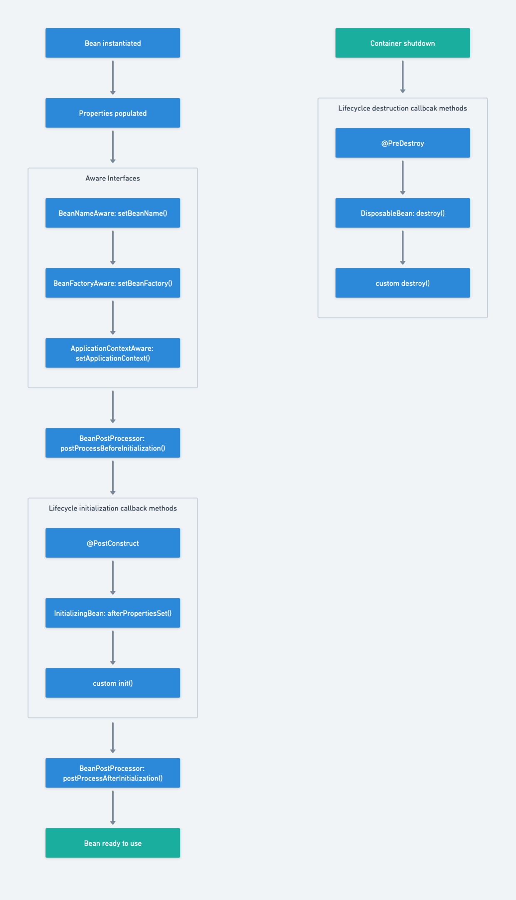

# Spring Bean Lifecycle



**Stage 1: Bean Lifecycle till it's ready to use**<br>

1) Bean instantiation. 
<br><br>
2) Bean's properties are populated.
   <br><br>
3) If the Bean implements Aware Interfaces, those implementation methods are executed.
   1) If the bean implements BeanNameAware interface, Spring passes current bean's name to the setBeanName () method and executes this method.
   2) If the bean implements BeanFactoryAware interface, Spring calls the setBeanFactory () method, passing in the bean factory itself and executes this method.
   3) If the bean implements ApplicationContextAware interface, Spring will call the setApplicationContext () method, passing in a reference to the current application context and executes this method.
   4) If the bean implements the BeanPostProcessor interface, Spring calls their postProcessBeforeInitialization () method.
   Other Aware interface implementation methods are executed.
      <br><br>
4) If the bean implements BeanPostProcessor, Spring will call their postProcessBeforeInitialization() method.
   <br><br>
5) The Lifecycle initialization callback methods are executed
   1) If the bean has @PostConstruct annotated method, it will be executed.
   2) If the bean implements InitializingBean interface, the implemented afterPropertiesSet() method will be executed.
   3) If the bean has a custom init method, the specified custom initialization method will be executed.
      <br><br>
6) If the bean implements BeanPostProcessor, Spring will call their postProcessAfterInitialization() method.
   <br><br>
7) Now, the bean becomes ready to be used by the application.

**Stage 2: Bean Lifecycle after container shutdown**<br>

1) The Lifecycle destruction methods are executed.
   1) If the bean has @PreDestroy annotated method, it will be executed.
   2) If the bean implements DisposableBean interface, the implemented destroy() method will be executed.
   3) If the bean has a custom destroy method, the specified custom destroy method will be executed.

## Example demonstrating the Spring Lifecycle

[_AwareBean.java_](./AwareBean.java)
```java
//imports

public class AwareBean implements BeanNameAware, BeanFactoryAware, 
        ApplicationContextAware, InitializingBean, DisposableBean {

    private int value;
    public AwareBean() {
        System.out.println("awareBean: constructor");
    }

    @Override
    public void setBeanName(String name) {
        System.out.println("awareBean: BeanNameAware's setBeanName()");
    }

    @Override
    public void setBeanFactory(BeanFactory beanFactory) throws BeansException {
        System.out.println("awareBean: BeanFactoryAware's setBeanFactory()");
    }

    @Override
    public void setApplicationContext(ApplicationContext applicationContext) throws BeansException {
        System.out.println("awareBean: ApplicationContextAwrae's setApplicationContext()");
    }

    @Override
    public void afterPropertiesSet() throws Exception {
        System.out.println("awareBean: InitializingBean's afterPropertiesSet()");
    }

    @Override
    public void destroy() throws Exception {
        System.out.println("awareBean: DisposableBean's destroy()");
    }

    public void customInit() {
        System.out.println("awareBean: custom init()");
    }

    public void customDestroy() {
        System.out.println("awareBean: custom destroy()");
    }

    @PostConstruct
    public void postConstruct() {
        System.out.println("awareBean: @PostConstruct");
    }

    @PreDestroy
    public void preDestroy() {
        System.out.println("awareBean: @PreDestroy");
    }

    public void setValue(int value) {
        System.out.println("awareBean: setValue()");
        this.value = value;
    }

    public void doSomething() {
        System.out.println("awareBean: doSomething()");
    }
    
}
```

[_CustomBeanPostProcessor.java_](./CustomBeanFactoryPostProcessor.java)
```java
//imports

public class CustomBeanPostProcessor implements BeanPostProcessor {

    @Override
    public Object postProcessBeforeInitialization(Object bean, String beanName) throws BeansException {
        System.out.println(beanName+" : BeanPostProcessor's postProcessBeforeInitialization()");
        return bean;
    }

    @Override
    public Object postProcessAfterInitialization(Object bean, String beanName) throws BeansException {
        System.out.println(beanName+" : BeanPostProcessor's postProcessAfterInitialization()");
        return bean;
    }
}
```

[_CustomBeanFactoryPostProcessor.java_](./CustomBeanFactoryPostProcessor.java)
```java
//imports

public class CustomBeanFactoryPostProcessor implements BeanFactoryPostProcessor {
    @Override
    public void postProcessBeanFactory(ConfigurableListableBeanFactory beanFactory) throws BeansException {
        System.out.println("customBeanFactoryPostProcessor: BeanFactoryPostProcessor's postProcessBeanFactory()");
    }
}
```

[_AppConfig.java_](./AppConfig.java)
```java
//imports

@Configuration
public class AppConfig {

    @Bean(initMethod = "customInit", destroyMethod = "customDestroy")
    public AwareBean awareBean() {
        AwareBean awareBean = new AwareBean();
        awareBean.setValue(10);
        return awareBean;
    }

    @Bean
    public CustomBeanFactoryPostProcessor customBeanFactoryPostProcessor() {
        return new CustomBeanFactoryPostProcessor();
    }

    @Bean
    public CustomBeanPostProcessor customBeanPostProcessor() {
        return new CustomBeanPostProcessor();
    }

    public static void main(String[] args) {
        AbstractApplicationContext applicationContext = new AnnotationConfigApplicationContext(AppConfig.class);
        System.out.println("ApplicationContext ready to use");
        AwareBean awareBean = applicationContext.getBean(AwareBean.class);
        awareBean.doSomething();
        applicationContext.close();
    }
}
```
Output:
```shell
customBeanFactoryPostProcessor: BeanFactoryPostProcessor's postProcessBeanFactory()
awareBean: constructor
awareBean: setValue()
awareBean: BeanNameAware's setBeanName()
awareBean: BeanFactoryAware's setBeanFactory()
awareBean: ApplicationContextAwrae's setApplicationContext()
awareBean : BeanPostProcessor's postProcessBeforeInitialization()
awareBean: @PostConstruct
awareBean: InitializingBean's afterPropertiesSet()
awareBean: custom init()
awareBean : BeanPostProcessor's postProcessAfterInitialization()
ApplicationContext ready to use
awareBean: doSomething()
awareBean: @PreDestroy
awareBean: DisposableBean's destroy()
awareBean: custom destroy()
```