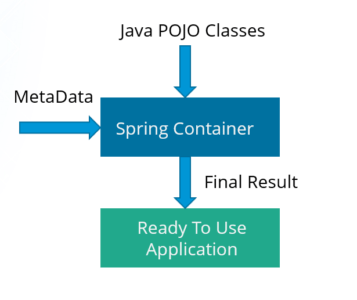
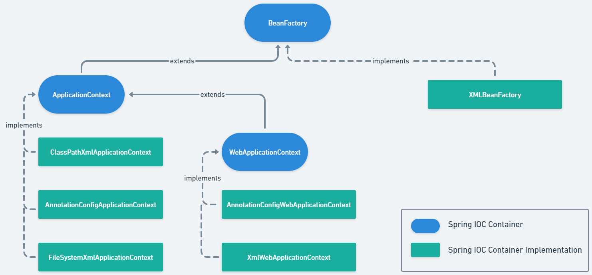

# Spring IOC Container

A component/program of spring framework which maintains the lifecycle of the managed objects. These managed objects are called Spring Beans.<br>
The IOC container is responsible for object creation, holding them in memory, injecting them into other objects as per need, as well as managing the entire
lifecycle of these objects from creation till destruction.

It implements the principle of dependency injection and facilitates loose coupling between components.

The important tasks performed by the IOC container are:
1. Instantiating the bean
2. Wiring the beans together
3. Configuring the beans
4. Managing the bean’s entire life-cycle

The following diagram represents a high-level view of how Spring works.



The IOC Container gets its instructions on what objects to instantiate, configure, and assemble by referring to
the configuration metadata provided.

The configuration metadata can be represented in three ways:
1. [XML based configuration](../dependency_injection/xml_configuration/README.md)
2. [Annotation based configuration](../dependency_injection/annotation_configuration/README.md)
3. [Java based configuration](../dependency_injection/java_configuration)

The configuration metadata consists of at least one and typically more than one bean definition that the container must manage.\
The Spring IoC container makes use of **Java POJO classes** and **Configuration metadata** to produce a fully configured and executable system or application.

In Spring there are two types of IOC Container
1. [BeanFactory](#beanfactory)
2. [ApplicationContext](#applicationcontext)

Spring provides several implementations of these containers.



## BeanFactory
It is the root interface for accessing the Spring Container and is defined in `org.springframework.beans.factory.BeanFactory`.

Bean Factory provides the basic support for Dependency Injection. It is based on factory design pattern which creates the beans of any type.<br>

BeanFactory follows lazy-initialization technique which means bean's metadata are loaded as soon as bean factory instance is
created but the beans are actually created only when `getBean()` method is called.


## ApplicationContext
It is the child interface of BeanFactory and is defined in `org.springframework.context.ApplicationContext`.

It is the advanced Spring container and is built on top of the BeanFactory interface. The ApplicationContext is the complete superset of BeanFactory.

ApplicationContext supports the features supported by Bean Factory but also provides some additional functionalities,
such as simple integration with Spring's AOP, message resource handling (for I18N), event propagation, application layer specific context (e.g. WebApplicationContext) for web application.<br>

ApplicationContext follows eager-initialization technique which means instance of beans are created as soon as you create the instance of Application context.

## Instantiating a Spring IOC container

### 1. BeanFactory Spring container

`XmlBeanFactory` is the implementation class for the `BeanFactory` interface.<br>
To use the `BeanFactory`, `XmlBeanFactory` class should be instantiated.

Ex: 
```java
Resource resource = new ClassPathResource("config.xml");
BeanFactory factory = new XmlBeanFactory(resource);
```

### 2. ApplicationContext Spring container

The location path or paths supplied to an ApplicationContext constructor are resource strings that let the container load configuration metadata from a variety of external resources,
such as the local file system, the Java CLASSPATH, and so on.

**Direct implementations of `ApplicationContext` :**
1. `AnnotationConfigApplicationContext` : For Annotation based metadata located in the classpath
2. `ClassPathXmlApplicationContext` : For XML based metadata located in the classpath
3. `FileSystemXmlApplicationContext` : For XML based metadata located in the file system
- To use `ApplicationContext` any one of these implementation classes can be instantiated.

#### 1. ClassPathXmlApplicationContext
`ClassPathXmlApplicationContext` is used to load an XML configuration file from the classpath.

Ex:
```java
ApplicationContext applicationContext = new ClassPathXmlApplicationContext("config.xml");
```
Here, **config.xml** is the XML based configuration file located in the classpath of the application.

#### 2. FileSystemXMLApplicationContext
`FileSystemXMLApplicationContext` class is used to load an XML-based Spring configuration file from the file system or from URLs.

Ex: 
```java
String path = "C:/Spring-core/src/main/resources/spring-config.xml";

ApplicationContext applicationContext = new FileSystemXmlApplicationContext(path);
```
Here, **path** describes the location of XML-based Spring configuration file.

#### 3. AnnotationConfigApplicationContext
AnnotationConfigApplicationContext class is used to load Annotation based configuration classes. 
It can take classes annotated with `@Configuration`, `@Component`, etc. as input.

```java
ApplicationContext applicationContext = new AnnotationConfigApplicationContext(AppConfig.class);
```
Here **AppConfig.class** is the Annotated Spring configuration class.


**Note:**
>`AnnotationConfigWebApplicationContext` and `XmlWebApplicationContext` are the implementations of `WebApplicationContext` and are used for web applications.

>Since, `ApplicationContext` is the child interface of `BeanFactory`, and `WebApplicationContext` is also an indirect child interface of `BeanFactory`.<br>
>Any implementation of `WebApplicationContext` can be referred using any of the following `BeanFactory` reference, `ApplicationContext` reference, or `WebApplicationContext` reference.<br>
>Similarly, any implementation fo `ApplicationContext` interface can be referred using `ApplicationContext` reference or `BeanFactory` reference.

## Retrieving a Bean from Spring IOC container

Both `BeanFactory` and `ApplicationContext` interface provide several overloded `getBean()` method to retrieve beans from the spring container.

Ex:
```java
Student student = (Student) context.getBean("student");
```
Here, **context** is the instance of `BeanFactory` or `ApplicationContext` implementation.

[//]: # (TODO: Add the overloaded methods)

**See also: [Bean Overview](./beans_overview/README.md)**