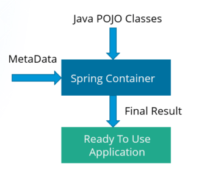

# Dependency Injection using Spring 

Dependency injection is a design pattern used to manage dependencies between classes or components.<br>
It makes a class independent of its dependencies.

In Spring the Dependency Injection is achieved through the [Spring IOC Container](../beans_and_ioc_container/README.md).<br>
It is responsible for object creation, holding them in memory, injecting them into other objects as per need and managing entire
lifecycle of these objects from creation till destruction.

## Types of Dependency Injection

1. Constructor Injection: Dependencies injected/passed through the constructor of the Bean.
2. Setter Injection: Dependencies injected/passed through the setter methods of the Bean.
3. Field Injection: Dependencies injected/passed directly into the bean's fields. Spring uses Java reflection to populate the dependency direclty.

## Constructor-based or setter-based Dependency Injection?

Since constructor-based and setter-based dependency injection can be mixed, it is a good rule to use constructor for mandatory
dependencies and setter methods for optional dependencies.

The use of @Autowired on a setter method makes the property a required dependency, instead constructor injection with
programmatic validation of arguments should be preferred.

A large number of constructor arguments is also a code smell as it implies that the class likely has too many responsibilities.
So, it should be redesigned to address proper separation of concerns.
Setter injection should primarily only be used for optional dependencies that can be assigned reasonable default values within the class. Otherwise, 
not-null checks must be performed everywhere the code uses the dependency.

## Configuration Metadata for Dependency Injection



The IOC Container gets its instructions on what objects to instantiate, configure, and assemble by referring to
the configuration metadata provided.\
Spring configuration consists of at least one and typically more than one bean definition that the container must manage.

The configuration metadata can be represented in three ways:
1. [XML based configuration](./xml_configuration/README.md)
2. [Annotation based configuration](./annotation_configuration/README.md)
3. [Java based configuration](./java_configuration/README.md)

## Lazy initialization of Beans

By default, ApplicationContext eagerly initializes all the Singleton beans during the initialization process. 
This is generally desirable as it helps to detect the configuration issues in early stages.
But, when this behaviour is not desirable the Singleton beans can be marked for lazy-initialization; and the IOC container 
will create the bean instance when it is first requested, rather than at startup.

[Lazy initialization](./lazy_initialization/README.md)

## Circular Dependencies

Circular dependencies can occur when beans depend on each other, creating a situation where one bean requires another bean 
before it's fully initialized itself.

[Circular Dependencies](./circular_dependencies/README.md)

## Controlling Beans Creation order

By default, Spring determines the bean creation order based on their dependencies. 
However, there are scenarios where one may need more control over the bean creation sequence.

The `depends-on` attribute in XML based declaration or `@DependsOn` annotation in Java and Annotation based declaration,
can be used to explicitly force the container to initialize one or more beans before initialization of a specific bean.

1. XML-based Configuration:
```xml
<!-- BeanA is created first -->
<bean id="beanA" class="com.example.BeanA" />

<!-- BeanB depends on BeanA and will be created after BeanA -->
<bean id="beanB" class="com.example.BeanB" depends-on="beanA" />
```

2. Java-based Configuration (Using `@DependsOn` Annotation):
```java
@Configuration
public class AppConfig {
    @Bean
    public BeanA beanA() {
        return new BeanA();
    }
    
    @Bean
    @DependsOn("beanA") // BeanB depends on BeanA
    public BeanB beanB() {
        return new BeanB();
    }
}
```

3. Annotation-based Configuration (Using `@DependsOn` Annotation):
```java
@Component
public class BeanA {
    // BeanA dependencies
}

@Component
@DependsOn("beanA") // BeanB depends on BeanA
public class BeanB {
    // BeanB dependencies
}
```

The `depends-on` attribute or `@DependsOn` annotation allows you to specify the beans that a particular bean depends on. 
This ensures that the dependent bean is created before the bean with the `depends-on` attribute or `@DependsOn` annotation.

>**Note:**<br>
>The depends-on relationship can specify both an initialization-time dependency and, in the case of singleton beans only, a corresponding destruction-time dependency. 
> Dependent beans that define a depends-on relationship with a given bean are destroyed first, prior to the given bean itself being destroyed. Thus, depends-on can also control shutdown order.

The usage of `depends-on` or `@DependsOn` should be handled carefully to avoid circular dependency issues and to ensure a smooth application startup.

