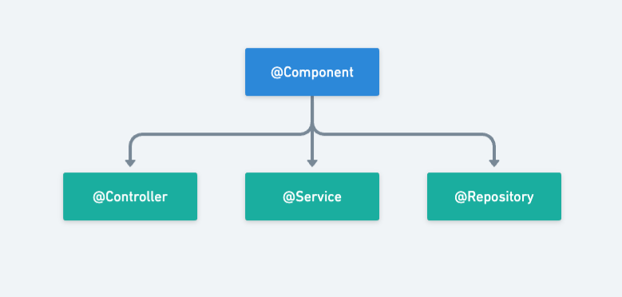

# Spring Dependency Injection using Annotation based configuration

Annotation-based configuration in Spring allows to configure beans and their dependencies using annotations.<br> 
It simplifies the configuration process by leveraging annotations to express the wiring and behavior of the application components.

>Annotation based injection is performed before XML injection. Thus, the latter configuration will override the former for properties wired through both approaches.

The XML declaration of beans is done in following fashion:
```xml
<beans ...
    ....>
    <!-- bean declarations -->
    <bean class="fullQualifiedClassName" id="beanName">
        ...
        ...
    </bean>
</beans>
```

The equivalent bean declaration can also be done using `@Component` annotation.

| xml           | Annotation   |
|---------------|--------------|
| `<bean .../>` | `@Component` |

`@Component` is a stereotype annotation and is used to mark a Java class as a Bean.
To use this simply apply it on a class, and the class would be marked as a bean.

Spring can automatically detect stereotyped classes (classes annotated with `@Component` and other stereotype annotations) and register corresponding 
bean instances with the IOC container.<br>
But, for allowing Spring framework to scan specific packages to get these classes and manage them, the component scan mechanism must be specified.

## Enabling Component Scanning:

The component scanning can be enabled either through XML configuration file or Java configuration file.

### 1. XML configuration file

Spring provides two XML configuration elements `<context:componet-scan>` and `<context:annotation-config/>` to configure and enable annotation 
based features.

1. `<context:component-scan/>`: It is used to enable component scanning. It tells Spring to automatically scan the specified base package and register stereotyped classes.
   ```xml
   <!--enabling component scan for the specified package-->
   <context:component-scan base-package="packageToScan"/>
   ```
   - The specified package and their sub-packages will be scanned for `@Component` and other stereotype annotated classes.

2. `<context:annotation-config/>`: It is used to enable support for common Spring annotations like `@Required`, `@Autowired`, `@PostConstruct`, `@PreDestroy` etc.
   ```xml
   <!-- enabling common annotations support -->
   <context:annotation-config />
   ```

>**Note:**<br>
>The use of `<context:component-scan>` implicitly enables `<context:annotation-config/>` as well, there is no need to explicitly include it.
>Furthermore, the `AutowiredAnnotationBeanPostProcessor` and `CommonAnnotationBeanPostProcessor` are both implicitly included as well.
> 
>And, the `<context:annotation-config/>` element implicitly registers the following post-processors:
>1. ConfigurationClassPostProcessor : Handles Spring's configuration class processing and bean definition registry.
>2. AutowiredAnnotationBeanPostProcessor : Enables the @Autowired annotation for automatic dependency injection.
>3. CommonAnnotationBeanPostProcessor : Handles common annotations like @PostConstruct, @PreDestroy, etc.
>4. PersistenceAnnotationBeanPostProcessor : Manages annotations like @PersistenceContext and @PersistenceUnit for JPA.
>5. EventListenerMethodProcessor : Facilitates the processing of event listener methods annotated with @EventListener

`ClassPathXmlApplicationContext` will be used as implementation of `ApplicationContext` as the configuration is xml file.

### 2. Java configuration file

```java
//imports
@Configuration
@ComponentScan(basePackages = "packageToScan")
public class JavaConfig {

}
```
- `@Configuration` is used to indicate that a class serves as a configuration class, bean declarations can also be done here using `@Bean`.
- `@ComponentScan` is used to specify the package for component scan.
The specified package and their sub-packages will be scanned for `@Component` annotated and other stereotype classes.<br>
- If solely `@ComponentScan` is used without specifying base package, it means the current package and its subpackage will be scanned for stereotyped classes.

`AnnotationConfigApplicationContext` will be used as implementation of `ApplicationContext` as the configuration file is a Java class.

The  component scan can also be enabled Programmatically.

#### **Enabling Component scan Programmatically:**
```java
AnnotationConfigApplicationContext context = new AnnotationConfigApplicationContext();
context.scan("packageToScan");
context.refresh();
```
## Autowiring

Autowiring enables automatic dependency injection without the need of explicit configuration.
Instead of manually wiring dependencies using setter methods or constructor arguments, Spring can automatically discover the required beans and wire them together based on certain rules.

[Autowiring in Annotation based configuration](./autowiring/README.md)

## Complete example demonstrating Annotation based bean definition

[_Engine.java_](./Engine.java)
```java
//imports
@Component("harrierEngine")
public class Engine {
    
    @Value("${engine.type}")
    private String type;
    
    @Value("${engine.displacement}")
    private String displacement;
    
    @Value("${engine.cylinder}")
    private int cylinder;
    
    @Value("${engine.transmissionType}")
    private String transmissionType;
    
    @Value("${engine.gearBox}")
    private String gearBox;

    public Engine() {
    }

    public Engine(String type, String displacement, int cylinder, String transmissionType, String gearBox) {
        this.type = type;
        this.displacement = displacement;
        this.cylinder = cylinder;
        this.transmissionType = transmissionType;
        this.gearBox = gearBox;
    }

    public String getType() {
        return type;
    }

    public void setType(String type) {
        this.type = type;
    }

    public String getDisplacement() {
        return displacement;
    }

    public void setDisplacement(String displacement) {
        this.displacement = displacement;
    }

    public int getCylinder() {
        return cylinder;
    }

    public void setCylinder(int cylinder) {
        this.cylinder = cylinder;
    }

    public String getTransmissionType() {
        return transmissionType;
    }

    public void setTransmissionType(String transmissionType) {
        this.transmissionType = transmissionType;
    }

    public String getGearBox() {
        return gearBox;
    }

    public void setGearBox(String gearBox) {
        this.gearBox = gearBox;
    }

    @Override
    public String toString() {
        return "Engine{" +
                "type='" + type + '\'' +
                ", displacement='" + displacement + '\'' +
                ", cylinder=" + cylinder +
                ", transmissionType='" + transmissionType + '\'' +
                ", gearBox='" + gearBox + '\'' +
                '}';
    }
}
```
- `@Value` annotation is used to refer to specified placeholder in properties file.

[_Car.java_](./Car.java)
```java
//imports
@Component("tataHarrier")
public class Car {
    
    @Value("${car.brand}")
    private String brand;

    @Value("${car.model}")
    private String model;

    @Autowired
    private Engine engine;

    @Value("#{${car.specifications}}")
    private Map<String,String> specifications;

    @Value("${car.features}")
    private List<String> features;

    @Value("#{'${car.colors}'.split(',')}")
    private Set<String> colors;

    public Car(){}

    public Car(String brand, String model, Engine engine, Map<String, String> specifications, 
               List<String> features, Set<String> colors) {
        this.brand = brand;
        this.model = model;
        this.engine = engine;
        this.specifications = specifications;
        this.features = features;
        this.colors = colors;
    }

    public String getBrand() {
        return brand;
    }

    public void setBrand(String brand) {
        this.brand = brand;
    }

    public String getModel() {
        return model;
    }

    public void setModel(String model) {
        this.model = model;
    }

    public Engine getEngine() {
        return engine;
    }

    public void setEngine(Engine engine) {
        this.engine = engine;
    }

    public Map<String, String> getSpecifications() {
        return specifications;
    }

    public void setSpecifications(Map<String, String> specifications) {
        this.specifications = specifications;
    }

    public List<String> getFeatures() {
        return features;
    }

    public void setFeatures(List<String> features) {
        this.features = features;
    }

    public Set<String> getColors() {
        return colors;
    }

    public void setColors(Set<String> colors) {
        this.colors = colors;
    }

    @Override
    public String toString() {
        return "Car{" +
                "\n brand='" + brand + '\'' +
                "\n model='" + model + '\'' +
                "\n engine=" + engine +
                "\n specifications=" + specifications +
                "\n features=" + features +
                "\n colors=" + colors +
                "\n}";
    }
}
```
- `@Value("${car.brand}")` & `@Value("${car.model}")` : specifies a value from the properties file based on specified placeholder.
- `@Value("#{${car.specifications}}")` : specifies a map of key-value pairs in JSON format. uses SpEL to evaluate the property values as map.
- `@Value("${car.features}")` : specifies comma separated list of Strings. Spring's default conversion service will automatically convert the comma-separated values from properties file into a `List<String>`.
- `@Value("#{'${car.colors}'.split(',')}")` :  a SpEL expression that evaluates to a set. `${car.colors}` is a property placeholder referring to the value of the property `car.colors` in the properties file.
The value of the property will be split by a comma using the split(',') method, resulting in individual elements.
- `@Autowired` : specifies autowiring of the specified dependency.


[_application.properties_](../../../../../../main/resources/com/refstash/dependency_injection/annotation_configuration/application.properties)
```properties
# Engine properties
engine.type = Kryotec 2.0 L Turbocharged Engine
engine.displacement = 1956cc
engine.cylinder = 4
engine.transmissionType = Automatic
engine.gearBox = 6

# Car properties
car.brand = Tata
car.model = Harrier
##list
car.features = Power Steering, Power Windows, Air Conditioner, Heater \
  Driver and Passenger Airbag, Automatic climate control

##set
car.colors = Orcus White, Calypso Red, Daytona Grey, Oberon Black

##Map
car.specifications ={Mileage: '14.6kmpl', 'Fuel Type': 'Diesel', 'Fuel Tank Capacity': 50.0, \
  'Seating Capacity': 5, 'Body Type': 'SUV'}
```

> Either of XML Configuration and Java based Configuration can be used. Both the approaches are specified below:

### XML Configuration

[_config.xml_](../../../../../../main/resources/com/refstash/dependency_injection/annotation_configuration/config.xml)
```xml
<?xml version="1.0" encoding="UTF-8"?>
<beans xmlns="http://www.springframework.org/schema/beans"
    xmlns:xsi="http://www.w3.org/2001/XMLSchema-instance"
    xmlns:context="http://www.springframework.org/schema/context"
    xmlns:util="http://www.springframework.org/schema/util"
    xsi:schemaLocation="http://www.springframework.org/schema/beans
    http://www.springframework.org/schema/beans/spring-beans.xsd
    http://www.springframework.org/schema/context
    http://www.springframework.org/schema/context/spring-context.xsd
    http://www.springframework.org/schema/util
    http://www.springframework.org/schema/util/spring-util.xsd">

    <!--bean declarations-->
    <!--Enable component scan-->
    <context:component-scan base-package="com.refstash.dependency_injection.annotation_configuration"/>
    <!--To externalize properties in a separate properties file-->
    <context:property-placeholder location="classpath:com/refstash/dependency_injection/annotation_configuration/application.properties"/>
</beans>
```
- The properties are provided in an external file `application.properties`
- `<context:property-placeholder/>` element is used to specify the external properties file.

- However, the util schema could also be used instead, to specify standalone collections here directly, and it would also be referred in bean in a similar fashion
(through `@Value` annotation).<br>
And the constant values would then be declared as
   ```java
    <util:constant id="brand"
           static-field="com.refstash.dependency_injection.annotation_configuration.Car.BRAND" />
   ```
   where `BRAND` would be a static constant defined in the specified `Car` class.

[_App.java_](./App.java)
```java
//imports

public class App {
    public static void main(String[] args) {
        ApplicationContext context = new ClassPathXmlApplicationContext("com/refstash/dependency_injection/annotation_configuration/config.xml");
        Car tataHarrier = context.getBean("tataHarrier", Car.class);
        System.out.println(tataHarrier);
    }
}
```
Output:
```shell
Car{
brand='Tata'
model='Harrier'
engine=Engine{type='Kryotec 2.0 L Turbocharged Engine', displacement='1956cc', cylinder=4, transmissionType='Automatic', gearBox='6-Speed'}
specifications={Mileage=14.6kmpl, Fuel Type=Diesel, Fuel Tank Capacity=50.0, Seating Capacity=5, Body Type=SUV}
features=[Power Steering, Power Windows , Air Conditioner, Heater, Driver and Passenger Airbag, Automatic climate control]
colors=[Orcus White, Calypso Red, Daytona Grey, Oberon Black]
}
```

Herein, xml file is used for configuration while the beans are configured through annotations.


### Java Configuration

[_AppConfig.java_](./AppConfig.java)
```java
//imports
@Configuration
@ComponentScan
@PropertySource("classpath:com/refstash/dependency_injection/annotation_configuration/application.properties")
public class AppConfig {
}
```
- `@PropertySource` annotation is used to externalize the configurations to an external properties file.
- The properties from this external properties file can either be injected through `@Value` annotation or using the `Environment`.

[_App.java_](./App.java)
```java
//imports

public class App {
    public static void main(String[] args) {
        ApplicationContext context = new AnnotationConfigApplicationContext(AppConfig.class);
        Car tataHarrier = context.getBean("tataHarrier", Car.class);
        System.out.println(tataHarrier);
    }
}
```
Output:
```shell
Car{
brand='Tata'
model='Harrier'
engine=Engine{type='Kryotec 2.0 L Turbocharged Engine', displacement='1956cc', cylinder=4, transmissionType='Automatic', gearBox='6-Speed'}
specifications={Mileage=14.6kmpl, Fuel Type=Diesel, Fuel Tank Capacity=50.0, Seating Capacity=5, Body Type=SUV}
features=[Power Steering, Power Windows , Air Conditioner, Heater, Driver and Passenger Airbag, Automatic climate control]
colors=[Orcus White, Calypso Red, Daytona Grey, Oberon Black]
}
```

Herein, Java file is used for configuration while the beans are configured through annotations.

`@PropertySource` annotation is used to externalize the configurations to an external properties file.
The properties from this external properties file can either be injected through `@Value` annotation or using the `Environment`.<br>
`@Component` marks a class as bean.<br>
`@Autoworing` is used for automatic dependency injection in Spring bean.<br>
`@Value` is used for injecting direct values or property placeholders or SpEL expressions in spring beans.

>**Note:**<br>
>The constructor, setter or field injection happens based on where the annotation like @Value or @Autowired is used.<br>
> If used on field directly it will be field injection, if used on setter methods it will be setter injection, and
> if used on constructor params it will be constructor injection.

## Stereotype Annotations
Stereotype annotations in Spring are used to mark classes with common characteristics or roles, allowing Spring to identify and process them automatically.<br>
These annotations are used to create Spring beans automatically in the application context.



`@Component` annotation is the main Stereotype Annotation and other stereotype annotations are derived from it.

The stereotype annotations in spring are `@Component`, `@Service`, `@Repository` and `@Controller`.

1. `@Component`:
   The `@Component` annotation is a generic stereotype annotation used to indicate that a class is a Spring-managed component. <br>
   It serves as a general-purpose stereotype and can be used with any class that should be managed by Spring. 
   When a class is annotated with `@Component`, Spring will automatically detect and instantiate it as a bean.

2. `@Service`:
   The `@Service` annotation is a specialization of the `@Component` annotation and is used to indicate 
   that a class represents a service in the business logic layer.<br>
   It is typically used to mark classes that handle complex business logic and provide specific services to other components.

3. `@Repository`:
   The `@Repository` annotation is another specialization of the `@Component` annotation 
   and is used to indicate that a class represents a repository or a data access object (DAO). <br>
   It is commonly used to mark classes that interact with databases or other persistent storage mechanisms.

4. `@Controller`:
   The `@Controller` annotation is used to mark a class as a Spring MVC controller. <br>
  It is typically used in web applications and is responsible for handling incoming requests, processing them, and returning the appropriate response.

These stereotype annotations provide a clear and expressive way to categorize and organize your Spring beans based on their roles and responsibilities.


**Note:**<br>
By default, the bean name for stereotyped classes would be the class name in camel case. But custom bean name can also be specified
with the annotation

| Bean Declaration                                                       | Bean instance name |
|------------------------------------------------------------------------|--------------------|
| <pre>@Component<br>public class Bean{<br>....<br>}</pre>               | `bean`             |
| <pre>@Component("customBean")<br>public class Bean{<br>....<br>}</pre> | `custormBean`      |
